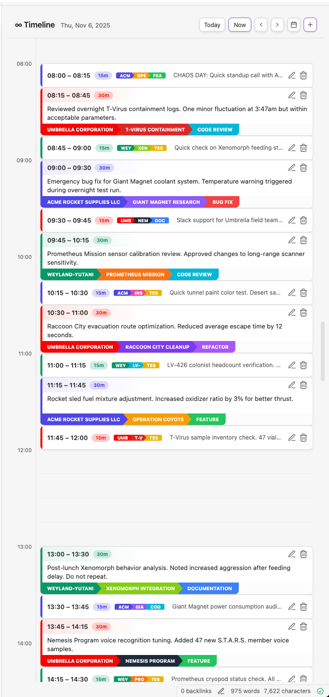
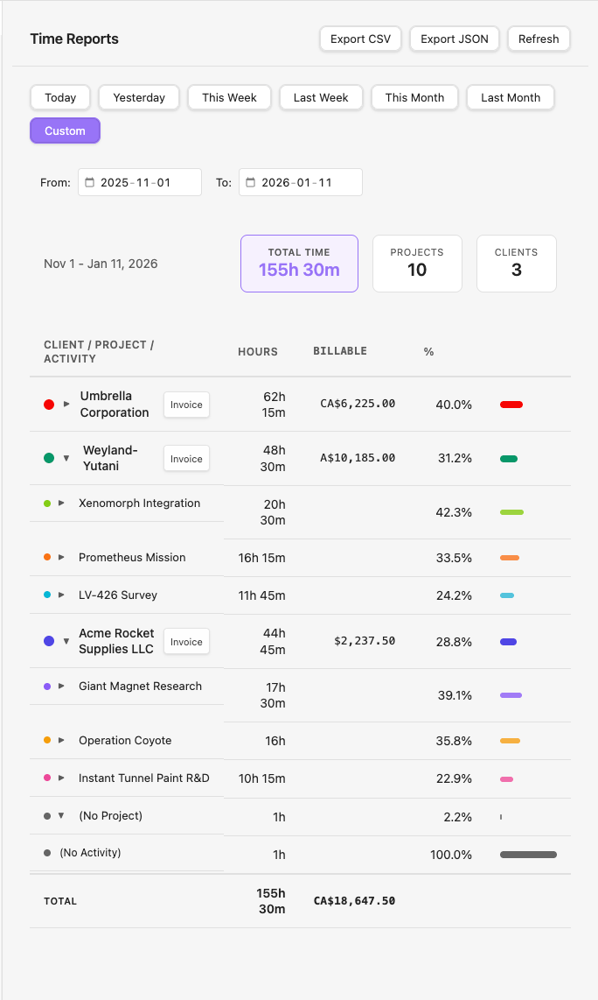

# Where Did The Time Go?

[](https://www.buymeacoffee.com/plattnum)

**A visual time tracking plugin for Obsidian.** An infinite-scroll timeline to log your hours, hierarchical reports to see where they went, and one-click invoicing to bill for them. Your data stays in your vault as plain markdown tables - no cloud, no sync, no subscriptions.

## Why This Exists

I got tired of:
- SaaS time trackers that take 10 seconds to load
- Monthly subscriptions for what amounts to a fancy spreadsheet
- Google Sheets (it works, but it's not fun)
- Apps that include "team collaboration features" when I just work alone
- Syncing conflicts, server outages, and "we're updating our privacy policy" emails

I wanted something **simple**: click, enter time, done. Data lives in my vault as plain markdown. Works offline. Loads instantly. No account required. No telemetry. No upsells.

If you need Gantt charts, resource allocation, task managment, or enterprise reporting - this isn't for you. If you just want to track where your hours went so you can bill clients or finally answer "wait, what did I actually do yesterday?".

**No timer feature.** I don't track my work by hitting start/stop on a stopwatch - it just doesn't fit how I work. I enter my time after the fact. If you need a running timer, this plugin isn't for you.

**Not a task manager.** This is purely time tracking - logging hours after the fact. My tasks live in external systems (Jira, Linear, GitHub Issues, etc). I didn't want to integrate with Obsidian Tasks or other task plugins that scan your entire vault. This plugin stays in its lane: you tell it what you worked on and when, it writes that to a table. That's it.

## Features

### ∞ Timeline
Visual day-by-day timeline that scrolls infinitely in both directions. Drag to create entries, drag to move them, resize to adjust duration. Click to edit.



### Simple Data Model
- **Clients** - Who you're billing (or "Personal" if you're tracking for yourself)
- **Projects** - What you're working on
- **Activities** - Type of work (dev, meeting, admin, etc.)
- **Linked Notes** - Optional wikilink to related notes in your vault

That's it. No tags, labels, priorities, estimates, story points, or whatever else PM tools have invented to justify their existence.

### Plain Markdown Storage
Your data lives in `TimeTracking/YYYY-MM.md` files as markdown tables:

```markdown
| Start            | End              | Description     | Client | Project | Activity | Notes |
| :--------------- | :--------------- | :-------------- | :----- | :------ | :------- | :---- |
| 2024-01-15 09:00 | 2024-01-15 10:30 | Morning standup | acme   | webapp  | meeting  |       |
| 2024-01-15 10:30 | 2024-01-15 12:00 | Fix login bug   | acme   | webapp  | dev      |       |
```

One file per month. Human-readable. Git-friendly. Portable - if this plugin dies, your data doesn't.

### Reports View
See where your time actually went. Select a date range and get a hierarchical breakdown: **Client → Project → Activity**, with hours and billable amounts at each level. Expand any level to drill down. Export to CSV or JSON when your accountant asks for timesheets.



### Invoice Generation
Generate markdown invoices directly from the Reports view. Each client row shows an **Invoice** button when there's billable time. Click it to:

1. Enter invoice number, issue date, and payment terms
2. Due date auto-calculates based on payment terms
3. Generate a markdown invoice with:
   - Your "Bill From" info (configured in Settings)
   - Client's billing address
   - Line items grouped by project (hours × rate)
   - Subtotal and total in the client's currency

Invoices are saved to your invoice folder (default: `TimeTracking/Invoices/`) as `{invoice-number}.md`. The generated markdown renders nicely in Obsidian and can be exported to PDF.

### Overlap Detection
Won't let you accidentally double-book yourself. The timeline shows conflicts in real-time.

### Midnight-Spanning Entries
Working late? Entries can cross midnight without breaking. The plugin handles multi-day entries correctly.

## Installation

### From Obsidian Community Plugins *(pending approval)*
Once approved:
1. Open Settings → Community Plugins
2. Search for "Where Did The Time Go"
3. Install and enable

### Manual Installation
1. Download `main.js`, `manifest.json`, and `styles.css` from the latest release
2. Create folder: `<vault>/.obsidian/plugins/where-did-the-time-go/`
3. Copy the files into that folder
4. Enable the plugin in Settings → Community Plugins

## Usage

### Creating Entries
- **Click + drag** on the timeline to create an entry
- **Click** the + button in the toolbar
- **Command palette** (`Ctrl/Cmd + P`) → "Create Time Entry"
- Fill in the details, hit Save

### Editing Entries
- **Click** an entry card to edit
- **Drag** entries to move them
- **Drag edges** to resize (change duration)

### Entry Modal Fields

When creating or editing an entry, you'll see these fields:

| Field | Description |
|-------|-------------|
| **Start** | Date and time the entry begins. 🧲 magnet button appears if there's an adjacent entry - click to snap to previous entry's end time. |
| **Duration** | Calculated automatically from start/end. You can also type directly (e.g., "1h 30m", "90m", "1.5h") and end time updates. |
| **End** | Date and time the entry ends. 🧲 magnet button snaps to next entry's start time if one exists. |
| **Client** | Required. Who you're billing. Configure clients in Settings. |
| **Project** | Optional. Filtered to show only projects belonging to the selected client. |
| **Activity** | Optional. Type of work (dev, meeting, etc.). Filtered by client. |
| **Description** | What you worked on. Character limit configurable in Settings. |
| **Linked Note** | Optional path to a related note. Use "Browse" to search existing notes or "Create New" to make one. |

**Overlap detection**: If your entry overlaps with an existing one, the conflicting times highlight red and Save is disabled until you fix it.

### Command Palette
- `Create Time Entry` - Open entry form directly (pre-fills current time)
- `Open Timeline` - Open the timeline view
- `Open Reports` - Open the reports view

## Settings

| Setting | Description |
|---------|-------------|
| **Time tracking folder** | Where to store monthly files (default: `TimeTracking`) |
| **Hide tables in preview** | Wrap tables in `%%` comments. If you open a monthly file directly, Obsidian won't try to render a large table - improves performance for busy months |
| **Hour height** | Pixels per hour in timeline (200-240) |
| **Day start/end hour** | Visible range in timeline |
| **Week start** | Monday or Sunday |
| **24-hour format** | Toggle 24h vs 12h time display |
| **Description max length** | Character limit for descriptions (0 = unlimited) |
| **Bill From name** | Your name or business name for invoices |
| **Bill From address** | Your billing address (multi-line) for invoices |
| **Invoice folder** | Where generated invoices are saved (default: `TimeTracking/Invoices`) |

## Clients, Projects & Activities

Configure in Settings:

- **Clients** - Each has a name, color, hourly rate, currency, billing address, and payment terms (for invoicing)
- **Projects** - Belong to a client, can override the client's hourly rate
- **Activities** - Work types (dev, meeting, review, etc.) per client

Colors appear as left-border indicators on timeline entries.

## Data Format

Monthly files follow this structure:

```markdown
%%
⚠️ WARNING: This file is managed by the "Where Did The Time Go" plugin.
Do not edit manually - your changes may be overwritten.
%%

# 2024-01

| Start            | End              | Description | Client | Project | Activity | Notes |
| :--------------- | :--------------- | :---------- | :----- | :------ | :------- | :---- |
| 2024-01-15 09:00 | 2024-01-15 10:30 | Standup     | acme   | webapp  | meeting  |       |
```

The `%%` markers hide the table in Obsidian's reading view (configurable in settings).

## FAQ

**Q: Can I edit the markdown files directly?**
A: You can, but the plugin may overwrite your changes. Use the Timeline view.

**Q: Does it sync across devices?**
A: It's just .md files. If your vault syncs (Obsidian Sync, iCloud, Dropbox, Git), your time entries sync.

**Q: Can I query entries with Dataview?**
A: No. Dataview doesn't parse markdown tables. Your data is portable plain text, but you'll use the Reports view for analysis.

**Q: What happens if I uninstall the plugin?**
A: Your data stays. It's just markdown files.

## Development

The repo includes a test vault at `vaults/where-did-the-time-go-vault/` with:
- 3 fictitious clients (Acme Rocket Supplies, Umbrella Corporation, Weyland-Yutani)
- 9 projects and 18 activities
- 74 test time entries across Nov-Dec 2025
- Edge cases: midnight-spanning entries, month boundaries, rapid 15-min entries

Run `npm run dev` to build in watch mode - output auto-copies to the test vault. See `docs/DEVELOPMENT.md` for details.

## Contributing

This is my side project - something I hack on when I have spare time. Not accepting pull requests for now, but feel free to open issues for bugs or feature ideas.

## License

MIT - Do whatever you want with it.

## Support

If this plugin saves you time, consider buying me a coffee.

[](https://www.buymeacoffee.com/plattnum)

---

*Built because I needed it, shared because maybe you do too.*
